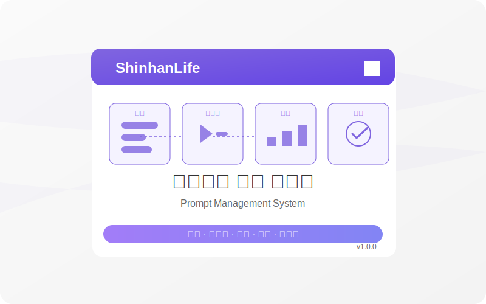

# 프롬프트 관리 시스템 (Prompt Management System)



대규모 언어 모델(LLM)용 프롬프트를 생성, 테스트, 분석 및 관리하기 위한 종합적인 웹 기반 솔루션입니다.

## 📋 목차

- [개요](#개요)
- [주요 기능](#주요-기능)
- [스크린샷](#스크린샷)
- [기술 스택](#기술-스택)
- [설치 및 설정](#설치-및-설정)
- [사용 방법](#사용-방법)
- [개발 가이드](#개발-가이드)
- [배포 방법](#배포-방법)
- [라이선스](#라이선스)

## 📝 개요

프롬프트 관리 시스템은 AI 모델(GPT-4, Claude, Gemini 등)과의 상호작용을 효율적으로 관리하고 최적화하기 위한 플랫폼입니다. 이 시스템은 기업과 개인이 AI 모델에 전달하는 프롬프트를 체계적으로 생성, 저장, 테스트, 평가하는 기능을 제공합니다.

## ✨ 주요 기능

### 대시보드
- 주요 메트릭(프롬프트 수, 실행 횟수, 팀원 등)에 대한 개요
- 최근 실행 내역 및 활성 A/B 테스트 상태 확인

### 프롬프트 라이브러리
- 모든 프롬프트를 중앙 집중식으로 관리
- 카테고리, 태그, 호환 모델별 필터링
- 그리드 및 리스트 뷰 지원

### 프롬프트 에디터
- 직관적인 프롬프트 작성 인터페이스
- 변수 관리 시스템
- 프롬프트 테스트 및 결과 미리보기
- 메타데이터 및 태그 설정

### 테스트 도구
- A/B 테스트 구성 및 결과 분석
- 여러 모델 간 성능 비교
- 일괄 테스트 실행 기능

### 분석 대시보드
- 사용량, 성능, 비용, 품질 메트릭 추적
- 카테고리별 분석 및 모델별 성능 비교
- 사용자 정의 기간 설정

### 팀 관리
- 사용자 역할 및 권한 관리
- 활동 로그 및 감사 추적
- 팀 성과 통계

## 📸 스크린샷

### 대시보드


### 프롬프트 에디터


### 테스트 도구


### 분석 화면


## 🛠️ 기술 스택

- **프론트엔드**: React, Tailwind CSS
- **아이콘**: Lucide React
- **상태 관리**: React Hooks
- **차트 및 시각화**: Recharts
- **배포**: GitHub Pages / AWS (선택 사항)

## ⚙️ 설치 및 설정

### 전제 조건
- Node.js v16 이상
- npm 또는 yarn

### 로컬 설치

```bash
# 저장소 클론
git clone https://github.com/KCRUISE/promptAgent.git
cd promptAgent

# 의존성 설치
npm install

# 개발 서버 실행
npm start
```

### 환경 변수 설정 (선택 사항)

`.env` 파일을 프로젝트 루트에 생성하여 필요한 환경 변수를 설정할 수 있습니다:

```
REACT_APP_API_URL=your_api_url
REACT_APP_GPT_API_KEY=your_openai_api_key
REACT_APP_CLAUDE_API_KEY=your_anthropic_api_key
```

## 📖 사용 방법

### 새 프롬프트 생성

1. 메인 화면에서 "새 프롬프트 작성" 버튼을 클릭합니다.
2. 프롬프트 제목과 템플릿을 입력합니다.
3. 필요한 변수를 정의합니다 (예: `{product_name}`, `{features}`).
4. 카테고리, 태그, 호환 모델을 설정합니다.
5. "저장" 버튼을 클릭하여 프롬프트를 저장합니다.

### 프롬프트 테스트 실행

1. 프롬프트 라이브러리에서 테스트할 프롬프트를 선택합니다.
2. "테스트" 탭으로 이동합니다.
3. 변수 값을 입력합니다.
4. AI 모델을 선택합니다.
5. "테스트 실행" 버튼을 클릭합니다.
6. 결과를 검토하고 평가합니다.

### A/B 테스트 생성

1. "테스트" 탭에서 "새 테스트 생성" 버튼을 클릭합니다.
2. A/B 테스트를 선택합니다.
3. 기준(A) 및 변형(B) 프롬프트를 설정합니다.
4. 테스트 기간 및 성공 지표를 설정합니다.
5. "테스트 시작" 버튼을 클릭합니다.

### 분석 확인

1. "분석" 탭으로 이동합니다.
2. 보고자 하는 메트릭과 기간을 선택합니다.
3. 필요에 따라 프롬프트 또는 모델별로 필터링합니다.
4. 데이터를 검토하고 인사이트를 얻습니다.

## 🧩 개발 가이드

### 프로젝트 구조

```
src/
├── components/       # UI 컴포넌트
├── contexts/         # React 컨텍스트 (상태 관리)
├── hooks/            # 커스텀 React 훅
├── services/         # API 서비스 및 데이터 처리
├── utils/            # 유틸리티 함수
├── styles/           # 글로벌 스타일
├── App.jsx           # 메인 애플리케이션 컴포넌트
└── index.js          # 앱 진입점
```

### 새 기능 추가하기

1. 관련 컴포넌트 생성/수정
2. 필요한 훅 및 서비스 구현
3. 주요 로직 구현 및 UI 연결
4. 테스트 및 문서화

## 🚀 배포 방법

### GitHub Pages로 배포

```bash
# package.json에 homepage 필드 추가
# "homepage": "https://kcruise.github.io/promptAgent",

# GitHub Pages 패키지 설치
npm install --save-dev gh-pages

# package.json에 스크립트 추가
# "predeploy": "npm run build",
# "deploy": "gh-pages -d build",

# 배포 실행
npm run deploy
```

### GitHub Actions로 자동 배포

저장소에 `.github/workflows/deploy.yml` 파일을 추가하여 자동 배포를 구성할 수 있습니다. 자세한 내용은 배포 자동화 스크립트를 참조하세요.

## 📄 라이선스

MIT 라이선스. 자세한 내용은 [LICENSE](LICENSE) 파일을 참조하세요.

---

## 🔗 유용한 링크

- [기여 가이드라인](CONTRIBUTING.md)
- [코드 스타일 가이드](CODE_STYLE.md)
- [API 문서](API.md)

## 🙏 감사의 말

- 프롬프트 관리 시스템 개발 팀
- 테스트 및 피드백을 제공해 주신 모든 사용자
- 오픈 소스 커뮤니티

---

문제가 있거나 제안이 있으시면 [이슈](https://github.com/KCRUISE/promptAgent/issues)를 생성해 주세요.
